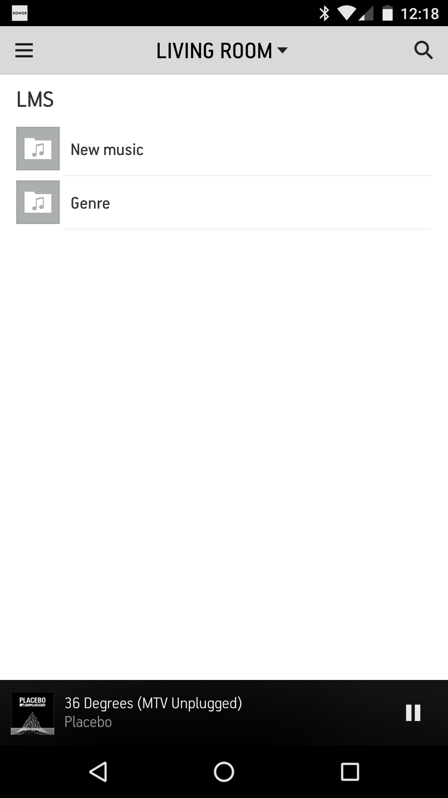

# Disclaimer

This is my first node app, so feel free to refactor and cleanup the code.
I used VScode and typescript, in order to use the app you need to compile the typescript files first.
This version is an early beta, it works, but cleanup and features are required ;-)

# LMSSonos

LMS Sonos is a bridge to show your Logitech Media Server (LMS) library within the SONOS app. 
You can run this code on your local PC or on a Synolgoy NAS. 

# Installation

## Compile and run Server

- Download or clone the repository
- Edit _config.ts_ and change the configuration settings
- Run _tsc_ to compile all typescript files
- Run _node index.js_

## Configure sonos

- Connect to your Sonosplayer http://[Sonos-IP]:1400/customsd.htm
- Set the following values:
    - SID: 255
    - Service name: LMS
    - Endpoint URL (IP and Port same as in config.ts): http://192.168.178.100:8080/service1.svc
    - Presentation map (IP and Port same as in config.ts): http://192.168.178.100:8080/presentationmap.xml
    - Container type: Music Service
    - Capabilities: Search
    
## Sonos App

Just launch your Sonos App and you should see your LMS collection in the app and be able to browse it.
     
    

 
    